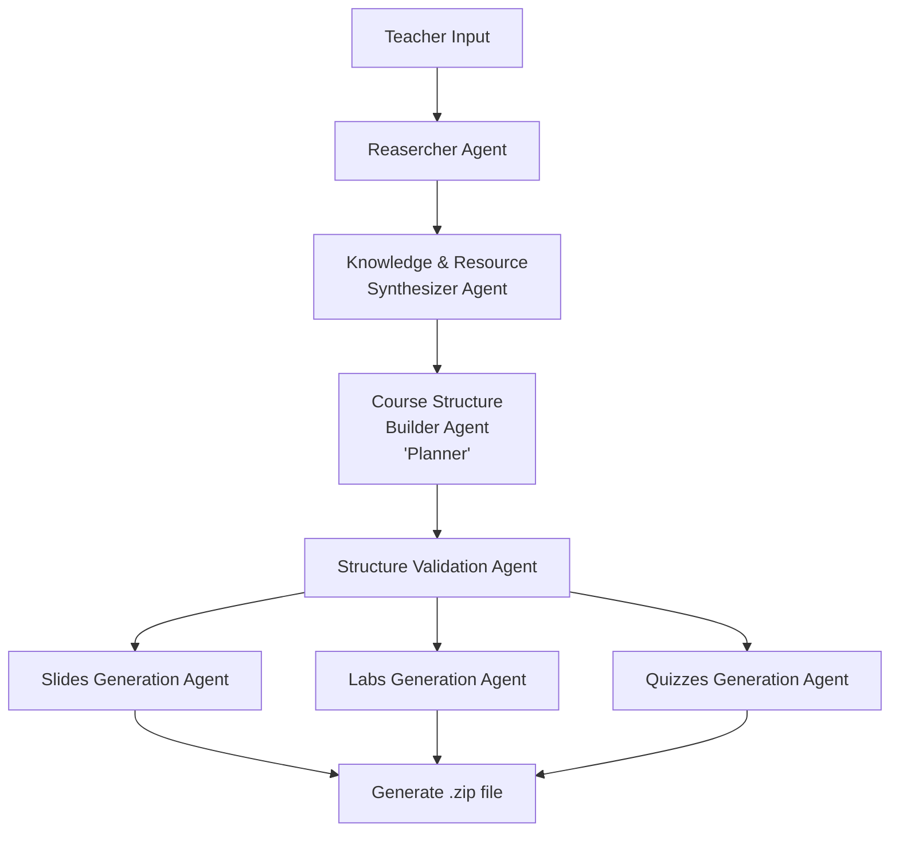

## Minhaj – AI Curriculum Builder 🎓

Minhaj is an agent-based AI system that transforms instructor inputs into a complete, structured, and exportable curriculum  including syllabus, slides, labs, and exams. in just one click.

---
## Features

- Generate a full curriculum based on:
  - Target topic
  - Learner level
  - Course duration
  - Preferred tools & technologies
  - Learning goals and constraints
  - Optional reference material support


---
## Agents Architecture

Minhaj is designed using an **agent-based AI architecture**, where each agent has a well-defined responsibility in the curriculum generation pipeline. to produce high-quality, structured educational content.




## Tech Stack

### AI & Orchestration
- LangGraph
- Groq API
- Tavily Search API

### Frontend
- HTML5
- Tailwind CSS
- Vanilla JavaScript

### Backend
- Python
- FastAPI
- REST API (JSON-based)

### Hosting
- Vercel


## Setup Instructions
1. Clone the repository:
```bash
git clone https://github.com/FaiOnayq/minhaj.git
cd minhaj
```

2. Create a virtual environment with uv then Activate
```bash
uv venv --python 3.11
.venv\Scripts\activate
```

3. Install dependencies:
```bash
uv pip install -r requirements.txt
```

4. Set up your .env file
Create a .env file in the root directory with the following keys:
```bash
GROQ_API_KEY=your_groq_api_key_here
TAVILY_API_KEY=your_tavily_api_key_here
```

5. Run the FastAPI app:
```bash
uvicorn main:app --reload
```
---


## Core Agents

### 1️- Interpreter

**Purpose:**  
Transforms user inputs into a structured (JSON) curriculum plan.

**Inputs:**
- Target topic
- Learner level
- Course duration
- learning goals
- Constraints & preferences
- link
- 
These inputs are validated on the frontend and converted into a **JSON payload**.


---
### 2- Web Research Agent (Tavily)

**Purpose:** Ground the curriculum in real-world, up-to-date knowledge.

**Responsibilities:**
- Convert the user topic into a structured search query
- Use Tavily to search the web
- Extract:
  - Relevant subtopics
  - Industry tools and frameworks
  - Best practices and trends

**Output:**
- Clean, summarized research context passed to downstream agents
---

### 4- Knowledge & Resource Synthesizer Agent

**Purpose:** Clean and organize the research findings.

**Responsibilities:**
- Reads the web results and any reference material provided by the user.
- Picks out the most important subtopics.
- Removes duplicates or irrelevant info.
- Creates a clear, focused knowledge summary for course planning.

### 3- Curriculum Planner Agent

**Purpose:** Design the overall course structure.

**Responsibilities:**
- Analyze learner level and duration
- Split content into weekly modules
- Define learning objectives per week
- Decide progression logic (from fundamentals → advanced)

**Output:**
Structured weekly curriculum plan

### 5- Validation & Alignment Agent

**Purpose:** Review and improve the course plan.

**Responsibilities:**
- Reviews the course structure for gaps or overloaded weeks.
- Ensures learning objectives match the planned content.

---

### 4- Content Generation Agents

These agents operate using the curriculum plan and research context.

#### - Slides Agent
- Generates lecture slide outlines and content
- Ensures alignment with weekly objectives

#### - Labs Agent
- Creates hands-on exercises and practical tasks
- Matches tools and difficulty level

#### Exams Agent
- Generates quizzes and exams
- Includes different question types
- Aligns assessments with learning outcomes
---


### Team

Built with ♡ by:
	•	Noura Aljandol
	•	Fai AlOnayq
	•	Wajan Alqahtani

